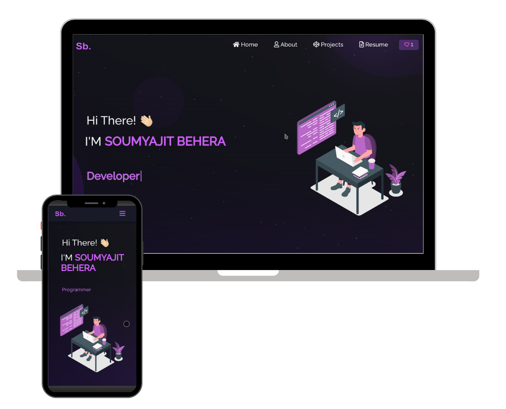

<h2 align="center">
  Portfolio BESSANH Shadrak<br/>
  Développeur IA & Full-Stack
</h2>

<div align="center">
  
</div>

<br/>

<center>

[](https://forthebadge.com) &nbsp;
[](https://forthebadge.com) &nbsp;
[](https://forthebadge.com)

</center>

## 👨‍💻 À propos

Portfolio personnel de BESSANH Shadrak, Développeur Logiciel et Développeur IA passionné par la transformation d'idées en solutions intelligentes et évolutives.

## 🚀 Technologies utilisées

Ce portfolio a été développé avec les technologies suivantes :

- **React.js** - Framework JavaScript pour l'interface utilisateur
- **Node.js** - Environnement d'exécution JavaScript
- **React Bootstrap** - Framework CSS pour le design responsive
- **React Icons** - Bibliothèque d'icônes
- **React Particles** - Effets de particules animées
- **Typewriter Effect** - Animation de texte dynamique
- **GitHub Calendar** - Visualisation des contributions GitHub

## ✨ Fonctionnalités

- **🎨 Design lumineux et moderne** - Interface claire avec palette de couleurs bleues (#2563EB)
- **📱 Entièrement responsive** - Adapté à tous les écrans (mobile, tablette, desktop)
- **⚡ Animations fluides** - Transitions et effets subtils pour une expérience agréable
- **🔗 Section contact interactive** - Liens directs vers GitHub, LinkedIn, Email et WhatsApp
- **💼 Projets en vedette** - Présentation de 6 projets IA/ML avec démos et code source
- **🛠️ Stack technique** - Affichage des compétences et outils maîtrisés
- **📊 Activité GitHub** - Calendrier de contributions en temps réel

## 📦 Installation et configuration

### Prérequis

- Node.js (v14 ou supérieur)
- npm ou yarn
- Git

### Installation

1. Cloner le repository :
```bash
git clone https://github.com/Bsh54/Shadrak_BESSANH.git
cd Shadrak_BESSANH
```

2. Installer les dépendances :
```bash
npm install
```

3. Lancer le serveur de développement :
```bash
npm start
```

Le site sera accessible sur [http://localhost:3000](http://localhost:3000)

## 📝 Personnalisation

Pour personnaliser ce portfolio :

1. **Informations personnelles** : Modifier `/src/components/Home/`
2. **Projets** : Éditer `/src/components/Projects/Projects.js`
3. **Compétences** : Mettre à jour `/src/components/About/Techstack.js` et `Toolstack.js`
4. **Couleurs** : Ajuster les variables CSS dans `/src/style.css`
5. **Images** : Remplacer les fichiers dans `/src/Assets/`

## 📫 Contact

- **GitHub** : [@Bsh54](https://github.com/Bsh54/)
- **LinkedIn** : [BESSANH Shadrak](https://www.linkedin.com/in/bessanh-shadrak-744049287/)
- **Email** : shadrakbsh@gmail.com
- **WhatsApp** : +229 01 97 42 65 400

## 🙏 Crédits

Template original par [Soumyajit Behera](https://github.com/soumyajit4419/Portfolio)
Personnalisé et adapté par BESSANH Shadrak

## ⭐ Support

Si vous aimez ce portfolio, n'hésitez pas à mettre une étoile ⭐ sur le repository !

---

<p align="center">
  Développé avec ❤️ par BESSANH Shadrak
</p>
